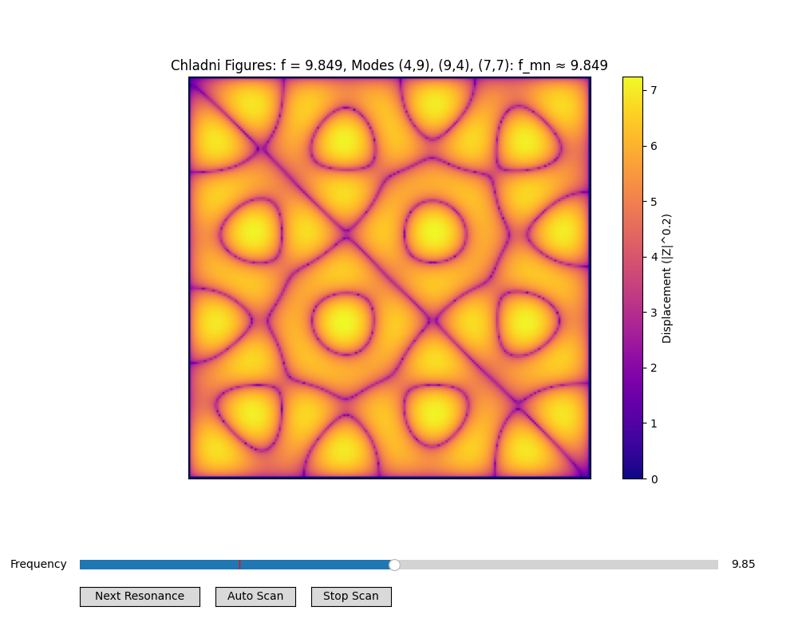
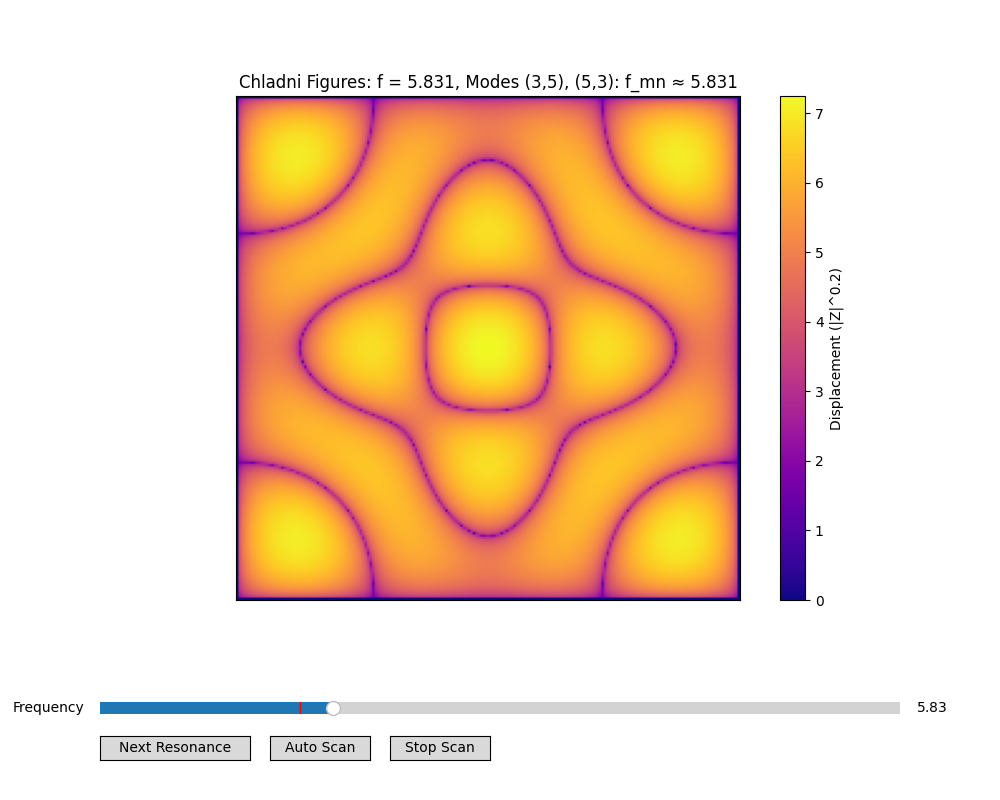
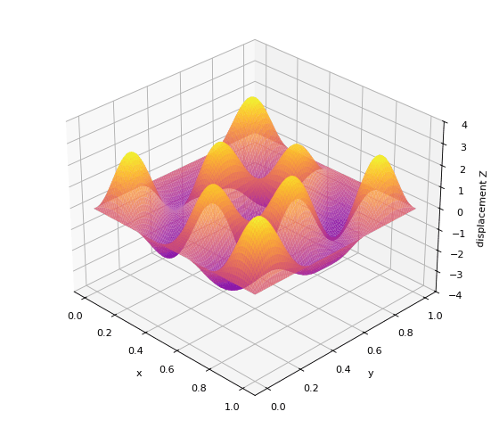

# Chladni Figures Simulation

This Python code simulates the nodal line patterns known as **Chladni figures** by visualizing the resonant modes of a vibrating surface. This is a computational approximation that captures the essential visual phenomenon without simulating particle dynamics.

---

## Table of Contents

- [Chladni Figures Simulation](#chladni-figures-simulation)
  - [Table of Contents](#table-of-contents)
  - [Historical Context](#historical-context)
  - [Physical Principles of Simulation (Free Oscillation at Eigenfrequency)](#physical-principles-of-simulation-free-oscillation-at-eigenfrequency)
    - [Simulation Implementation Principles (Forced Oscillation at Driving Frequency)](#simulation-implementation-principles-forced-oscillation-at-driving-frequency)
  - [Key Parameters](#key-parameters)
  - [Frequency Scaling Factor *k*](#frequency-scaling-factor-k)
  - [Damping Factor γ](#damping-factor-γ)
    - [Combined Effect of γ on Mode Superposition and Patterns](#combined-effect-of-γ-on-mode-superposition-and-patterns)
  - [Usage](#usage)
  - [Controls](#controls)
  - [Limitations](#limitations)
  - [References](#references)

---

## Historical Context

Ernst Chladni (1756–1827), often called the *father of acoustics*, studied how vibrating plates caused **particles like sand or powder to accumulate along nodal lines**—regions where the plate remains stationary. These patterns, now known as **Chladni figures**, visually reveal the **standing wave patterns** on the plate.

In his experiments:

- A thin metal plate is fixed at its center or edges.
- It is vibrated with a violin bow at different frequencies.
- Fine particles move away from areas of high vibration and collect along **nodal lines**, producing beautiful geometric patterns.

Chladni figures were key in understanding **vibrational modes** and laid foundations for acoustics, wave physics, and modern mechanical engineering.

---

## Physical Principles of Simulation (Free Oscillation at Eigenfrequency)

The displacement field of a **single vibrational eigenmode** $(m,n)$ on a rectangular plate of size $L_x \times L_y$ is given by

$$
Z_{mn}(x,y,t) = A \,\sin\!\left(\tfrac{m \pi x}{L_x}\right)\sin\!\left(\tfrac{n \pi y}{L_y}\right)\cos(2 \pi f_{mn} t),
$$

where:

- $m$ and $n$ describe the complexity of the pattern: they determine how many stationary nodal lines appear along the $x$- and $y$-directions of the plate.

>In more technical language, $m$ and $n$ correspond to the number of half-wavelengths (or nodal divisions) that “fit” across the plate in the $x$ and $y$ directions.

- $A$ is the oscillation amplitude.
- $f_{mn}$ is the eigenfrequency of the $(m,n)$ mode, given by

$$
f_{mn} = k \sqrt{\left(\tfrac{m}{L_x}\right)^2 + \left(\tfrac{n}{L_y}\right)^2},
$$

with $k$ setting the frequency scale. In real plates $k$ depends on material properties, but in this simplified simulation we take $k=1$.

The **nodal lines** of this mode come from the zeros of the spatial factor

$$
\sin\!\left(\tfrac{m \pi x}{L_x}\right)\sin\!\left(\tfrac{n \pi y}{L_y}\right) = 0
$$

which are independent of time. These lines are where particles accumulate in experiments, forming the classic Chladni figures.

---

### Simulation Implementation Principles (Forced Oscillation at Driving Frequency)

In experiments, plates are usually driven at a chosen **driving frequency** $f$, not at their natural eigenfrequencies alone. The resulting motion is a **superposition of many eigenmodes**, each contributing according to how close the driving frequency is to that mode’s eigenfrequency and how strongly damping allows it to respond.

The steady-state spatial response is modeled as

$$
Z(x,y; f) = \sum_{m=1}^{M} \sum_{n=1}^{N}
\frac{\sin(m \pi x)\sin(n \pi y)}{(f - f_{mn})^2 + \gamma^2}.
$$

Here, the damping factor $\gamma$ controls how sharply each resonance is excited:

- with small $\gamma$, primarily a single eigenmode (or a degenerate pair) dominates,
- with larger $\gamma$, multiple nearby modes contribute.

This broadening effect mimics real experiments, where imperfections, boundary conditions, or bowing techniques naturally excite a mixture of modes, giving rise to the rich variety of Chladni patterns.

>Top: Forced oscillation at steady state (time-independent amplitude distribution that sand particles would respond to).  
Bottom: Free oscillation evolving in time (from own Python simulation).  
Both illustrate a superposition of the degenerate modes (3,5) and (5,3), which share the same eigenfrequency but differ in shape.

1. **Visualization:**
   - The absolute displacement is visualized as colormap with |Z|^0.2 to enhance contrast of nodal lines.
   Dark regions approximate nodal lines; bright regions are anti-nodes.

   - The resulting superposition (modulated by γ) roughly captures the richness of real Chladni patterns.
   While the simulation assumes a nearly single-frequency drive (like a bow), γ mimics real-world plate imperfections that broaden resonances, causing several nearby modes to be excited simultaneously.

   - The title shows the driving frequency and the frequency of the most dominant mode. The displayed pattern may be a single mode or a superposition of multiple modes, with the strongest contributions near resonances. At other frequencies (e.g., when manually moving the frequency slider), the plate still responds, but the patterns do not represent true Chladni figures.

2. **Approximation and Model Choice:**
   - **Particles are not explicitly simulated**.
   - The mathematical model uses an ideal flexible **membrane** (like a drumhead) under tension, with sinusoidal eigenfunctions and eigenfrequencies proportional to \$\sqrt{m^2 + n^2}\$. This simplifies the physics of rigid **plates** with bending stiffness.
   - The membrane model was chosen for **computational efficiency**, allowing real-time interactive exploration. This approach successfully captures the qualitative behavior and visual essence of modal patterns, reproducing the kinds of figures observed when a real plate is driven by a bow.

---

## Key Parameters

| Parameter    | Description                          | Typical Effect                                                                                                                                          |
| ------------ | ------------------------------------ | ------------------------------------------------------------------------------------------------------------------------------------------------------- |
| `max_mode`   | Maximum mode numbers \$M\$ and \$N\$ | Higher values allow more complex patterns, slower computation                                                                                           |
| `gamma (γ)`      | Damping factor | Controls resonance width and amplitude; small γ → sharp, symmetric patterns; medium γ → slight asymmetry; large γ → diffuse, complex patterns; also influences mode overlap and mimics imperfections |
| `k`          | Frequency scaling factor             | Adjusts eigenfrequency scale                                                                                                                            |
| `resolution` | Grid resolution                      | Higher → smoother visual patterns, slower computation                                                                                                   |
| `init_freq`  | Initial driving frequency            | Starting frequency when simulation launches                                                                                                             |

---

## Frequency Scaling Factor *k*

In the eigenfrequency expression

$$
f_{mn} = k \sqrt{\left(\frac{m}{L_x}\right)^2 + \left(\frac{n}{L_y}\right)^2},
$$

the parameter **k** sets the **overall frequency scale** of the simulation.

1. **Physical Meaning:**

   - For a real membrane or plate, the eigenfrequency depends on **geometry** (plate dimensions) and **material properties** (tension, density, stiffness).
   - These details are collapsed into a single proportionality constant. In this simplified model, that constant is represented by **k**.

2. **Role in the Simulation:**

   - **Larger k** → shifts all resonances to **higher frequencies**.
   - **Smaller k** → shifts all resonances to **lower frequencies**.
   - Importantly, **k does not change the shape of the modal patterns**—only their placement along the frequency axis.

3. **Interpretation:**

   - Think of **k** as a **tuning knob** that lets you control where in the frequency range the resonances appear.
   - While **γ** governs how sharply modes appear and blend, **k** simply sets the “frequency scale” of the entire system.

4. **Guidelines:**

   - Adjust **k** to place resonances in a convenient range for exploration.
   - Once chosen, k can usually remain fixed, while **γ** and the driving frequency `f` are varied interactively.

>Practical Note: Increasing k spreads all eigenfrequencies farther apart. For a fixed γ, this means fewer modes are significantly excited at a given driving frequency, making patterns appear more symmetric — similar to the effect of using a smaller γ. In the simulation title, only the driving frequency and the most dominant mode’s eigenfrequency are displayed, so this spread of other modes is not visible there.

---

## Damping Factor γ

In the simulation, the total displacement field is computed as:

$$
Z(x,y; f) = \sum_{m=1}^{M} \sum_{n=1}^{N} \frac{\sin(m \pi x) \sin(n \pi y)}{(f - f_{mn})^2 + \gamma^2}
$$

Here, **γ** is the **damping factor**. The following graph illustrates its primary function: controlling the resonance width and amplitude peak. A smaller γ results in a sharper, taller response, meaning only frequencies very close to the resonant frequency \$f\_{mn}\$ will excite that mode. A larger γ creates a broader, shorter response, allowing multiple nearby modes to contribute to the pattern simultaneously.

Its role in the simulation is multi-faceted:

1. **Resonance Width**

   - Small γ → narrow resonance: only modes very close to \$f\$ contribute.
   - Large γ → wide resonance: multiple modes contribute simultaneously.

2. **Mode Superposition & Symmetry**
   In an ideal plate, some vibration modes are **degenerate** (same eigenfrequency), e.g., \$f\_{12} = f\_{21}\$ on a square plate. The damping factor γ controls how modes combine:

   - Very small γ excites one mode or a degenerate pair nearly equally → highly symmetric patterns.
   - Increasing γ allows nearby non-degenerate modes to contribute → subtle asymmetries.
   - Large γ excites many overlapping modes → asymmetric, complex patterns.

3. **Mimicking Physical Imperfections**

   - Real plates have variations in thickness, material, or boundaries.
   - Increasing γ reproduces the effect of these imperfections by broadening resonance peaks.

4. **Amplitude Control**

   - Maximum mode contribution at resonance (\$f=f\_{mn}\$) is \$1/\gamma^2\$.
   - Smaller γ → sharper nodal lines, higher amplitude.
   - Larger γ → blended, lower-amplitude patterns.

---

### Combined Effect of γ on Mode Superposition and Patterns

| γ Range        | Mode Excitation                                                               | Resulting Pattern Description                                                                    |
| -------------- | -------------------------------------------------------------------------------- | ------------------------------------------------------------------------------------------------ |
| **≈0.01–0.03** | Single dominant mode or nearly degenerate pair dominates                         | Sharp, symmetric nodal patterns — idealized plate behavior                                       |
| **≈0.05–0.1**  | Degenerate/near-degenerate modes blend; nearby non-degenerate modes start mixing | Slight asymmetry appears; nodal lines subtly distorted, simulating minor imperfections           |
| **>0.1**       | Many overlapping modes contribute significantly                                  | Diffuse, asymmetric, complex patterns; nodal lines blur, simulating strong damping/imperfections |

> **Tip:** Adjust γ in your simulation to watch the transition from symmetric idealized figures to complex, realistic Chladni patterns.

---

## Usage

- Use the frequency slider to explore modes.
- Experiment with damping γ to see symmetry/asymmetry effects.

---

## Controls

| Control               | Function                       |
| :-------------------- | :----------------------------- |
| Frequency Slider      | Adjust driving frequency.      |
| Next Resonance Button | Jump to next higher resonance. |
| Scan Button           | Sweep frequency automatically. |
| Stop Scan Button      | Stop automatic scanning.       |

---

## Limitations

- Field-based simulation; **does not model particle dynamics**.
- Only finite `max_mode` included.
- Damping γ is uniform; real plates have non-uniform damping.
- Geometry is idealized square plate.
- Uses a membrane model for computational efficiency, which simplifies the physics of a true plate with bending stiffness.

---

## References

- Chladni, Ernst Florens Friedrich. *Entdeckungen über die Theorie des Klanges*. Leipzig: Weidmanns Erben und Reich, 1787. ETH-Bibliothek Zürich,
  Rar 5284. <https://doi.org/10.3931/e-rara-4235>. Public Domain Mark.

- Herman, Russell. Vibrations of Rectangular Membranes. (2024, September 4) University of North Carolina Wilmington. CC BY‑NC‑SA. <https://math.libretexts.org/@go/page/90264>
  
- Wikipedia contributors. “Ernst Chladni.” Wikipedia. <https://en.wikipedia.org/wiki/Ernst_Chladni>
  
Further Reading  

- Tuan, P.H., Lai, Y.H., Wen, C.P. et al. Point-driven modern Chladni figures with symmetry breaking. Sci Rep 8, 10844 (2018).
  <https://doi.org/10.1038/s41598-018-29244-6>

- Tseng, Yu-Chen, Yu-Hsin Hsu, Yu-Hsiang Lai, Yan-Ting Yu, Hsing-Chih Liang, Kai-Feng Huang, and Yung-Fu Chen. 2021. “Exploiting Modern Chladni Plates to Analogously Manifest the Point Interaction” Applied Sciences 11, no. 21: 10094. <https://doi.org/10.3390/app112110094>
