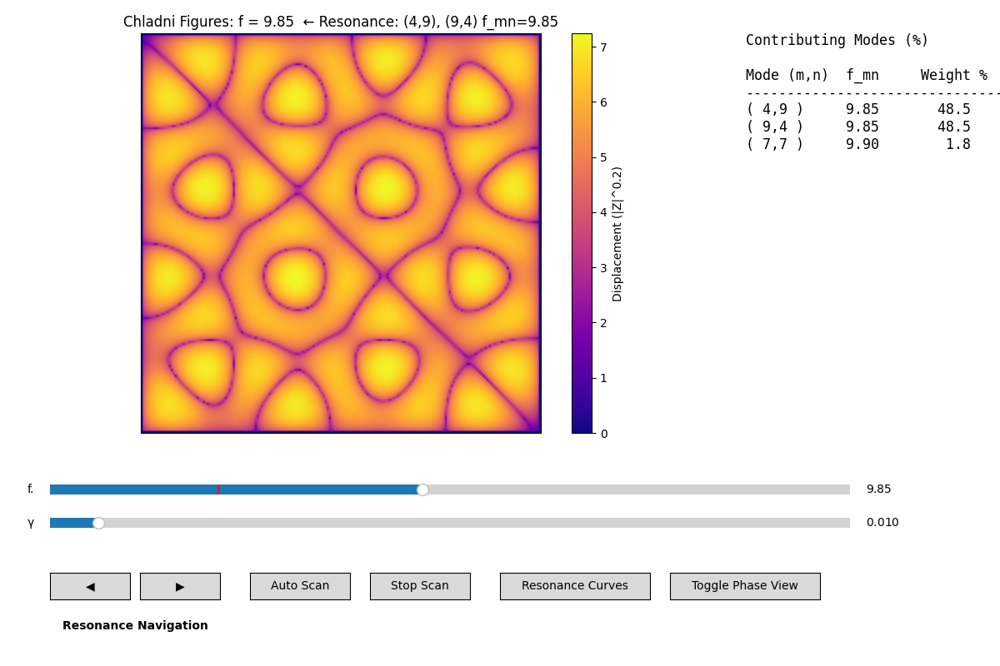
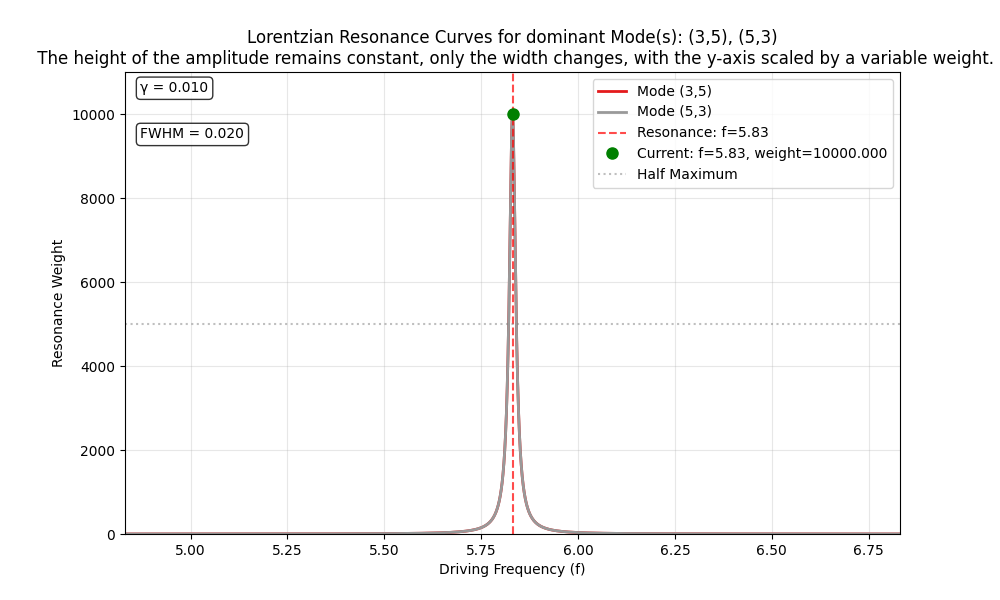
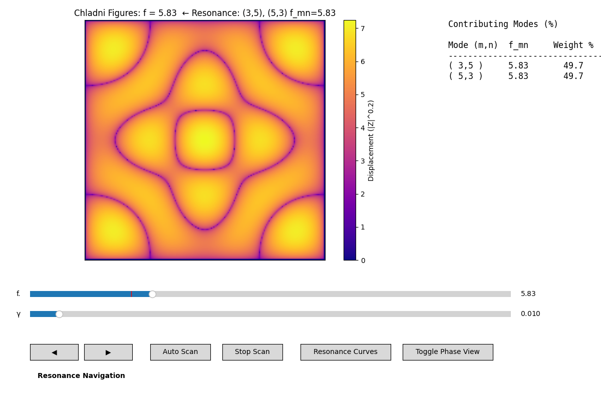
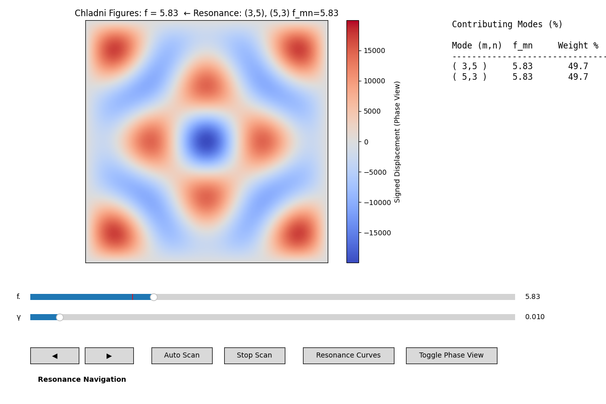
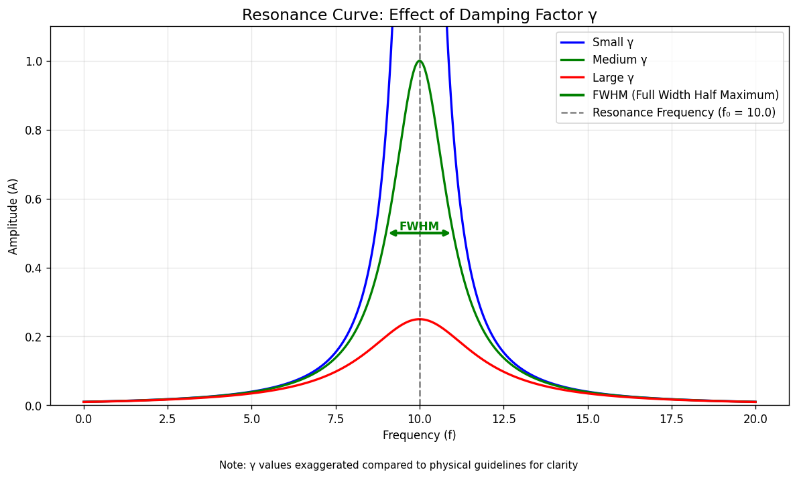

# Chladni Figures Simulation

This Python code (Chladni_Figures.py) simulates the nodal line patterns of Chladni figures, approximating Ernst Chladni’s 1787 experiments with vibrating plates by modeling the resonant modes of a square membrane. It captures the visual essence of these wave patterns without simulating the complex dynamics of particle motion.

---

## Table of Contents

- [Chladni Figures Simulation](#chladni-figures-simulation)
  - [Table of Contents](#table-of-contents)
  - [Historical Context](#historical-context)
  - [Physical Principles of Simulation (Free Oscillation at Eigenfrequency)](#physical-principles-of-simulation-free-oscillation-at-eigenfrequency)
  - [Simulation Implementation Principles (Forced Oscillation at Driving Frequency)](#simulation-implementation-principles-forced-oscillation-at-driving-frequency)
  - [Key Parameters](#key-parameters)
  - [Frequency Scaling Factor *k*](#frequency-scaling-factor-k)
  - [Damping Factor γ](#damping-factor-γ)
    - [Combined Effect of γ on Mode Superposition and Patterns](#combined-effect-of-γ-on-mode-superposition-and-patterns)
  - [Usage](#usage)
  - [Controls](#controls)
  - [Limitations](#limitations)
  - [Simulation–Experiment Match Fidelity](#simulationexperiment-match-fidelity)
  - [References](#references)

---

## Historical Context

Ernst Chladni (1756–1827), known as the father of acoustics, pioneered the study of vibrational modes by observing how elastic plates, sprinkled with sand or powder, formed Chladni figures—geometric patterns along nodal lines where the surface remains stationary. These patterns reveal standing waves and remain a subject of research today.

In his 1787 experiments:

- An elastic plate (thin brass plate) was fixed at its center or edges.

- It was vibrated with a violin bow at various frequencies.

- Particles migrated from high-vibration areas to nodal lines, creating striking patterns.

Chladni figures laid foundations for acoustics, wave physics, and applications like mechanical engineering, with their nodal patterns inspiring both historical and modern scientific inquiry.

---

## Physical Principles of Simulation (Free Oscillation at Eigenfrequency)

The displacement field of a single vibrational eigenmode  ((m,n)) on a membrane of size $L_x \times L_y$ is described  by:

$$
Z_{mn}(x,y,t) = \left[ A \cos(2\pi f_{mn} t) + B \sin(2\pi f_{mn} t) \right] \sin\left(\frac{m \pi x}{L_x}\right) \sin\left(\frac{n \pi y}{L_y}\right)
$$

where:

- The numbers $m$ and $n$ shape the membrane’s vibration, forming $m-1$ stationary nodal lines (where the membrane stays still) across the $x$-direction and $n-1$ across the $y$-direction. The $(1,1)$ mode has no interior nodal lines, creating one vibrating region
- $A$ and $B$ are amplitudes set by initial conditions (displacement and velocity)
- $f_{mn}$ is the eigenfrequency of the $(m,n)$ mode, given by

$$
f_{mn} = k \sqrt{\left(\tfrac{m}{L_x}\right)^2 + \left(\tfrac{n}{L_y}\right)^2},
$$

The constant $k$ sets the overall frequency scale for the membrane’s vibrational modes. In this simplified simulation, we set $k=1$ to normalize the frequencies. In real Chladni plates, the frequency scale depends on material properties (e.g., density and stiffness) and the plate’s thickness and size, which determine the actual vibration frequencies.

The **nodal lines** of this mode come from the zeros of the spatial factor

$$
\sin\!\left(\tfrac{m \pi x}{L_x}\right)\sin\!\left(\tfrac{n \pi y}{L_y}\right) = 0
$$

which are independent of time. These lines are where particles accumulate in experiments, forming the classic Chladni figures.

The membrane’s motion during free oscillation, when it vibrates naturally without external forces, may be a superposition of multiple modes:

$$
Z(x, y, t) = \sum_{m=1}^{M} \sum_{n=1}^{N} \left[ A_{mn} \cos(2\pi f_{mn} t)+ B_{mn} \sin(2\pi f_{mn} t) \right] \sin\left(\frac{m\pi x}{L_x}\right) \sin\left(\frac{n\pi y}{L_y}\right)
$$

>Symmetric geometries such as the square membrane (Lx = Ly) may exhibit degenerate modes: distinct nodal patterns with different shapes but the same eigenfrequency — for example, the (3,5) and (5,3) modes. This degeneracy, a hallmark of symmetric geometries, enhances pattern variety in both this membrane simulation and real Chladni experiments.

>Animated 3D plot of free oscillation, showing the time-dependent displacement field $Z(x,y,t)$ of the degenerate modes (3,5) and (5,3), with cosine-only time dependence. The cosine term corresponds to the membrane starting at maximum height with zero initial velocity, producing stable nodal lines at $Z=0$. Vibrations are amplified and slowed for visual clarity.

---

## Simulation Implementation Principles (Forced Oscillation at Driving Frequency)

In real experiments and this simulation, the system is driven at a chosen frequency f, producing vibrations through a superposition of eigenmodes, each weighted by a resonance factor that depends on a damping effect.

>The simulation uses a 0–20 Hz range as a simplified, abstract scale to highlight nodal patterns, which depend only on mode shapes and resonance weights, not physical frequencies. Real Chladni experiments typically drive plates at 50–5000 Hz to excite their eigenfrequencies.

The steady-state spatial response for a square membrane Lx = Ly = 1 at driving frequency f is modeled as:

$$
Z(x,y; f) = \sum_{m=1}^{M} \sum_{n=1}^{N}
\frac{\sin(m \pi x)\sin(n \pi y)}{(f - f_{mn})^2 + \gamma^2}
$$

with eigenfrequencies simplified to:

$$
f_{mn} = k \sqrt{m^2 + n^2}
$$

The fraction:

$$
\frac{1}{(f-f_{mn})^2 + \gamma^2}
$$

>Lorentzian weighting reflects the frequency response of a damped, driven harmonic oscillator.

acts as a **resonance factor**, modulating the effective (weighted) spatial amplitude of each mode depending on how close the driving frequency $f$ is to its eigenfrequency $f_{mn}$.

The damping term is implemented as $γ^2$, where $γ$ is the damping factor. This parameter controls how sharply or broadly modes are excited. A small $γ$ produces narrow, isolated resonances, while a larger value blends contributions from neighboring modes.

Top: A 2D static plot showing the time-independent displacement amplitude $Z(x,y,f)$ of the steady-state response to a driving frequency f​, matching the eigenfrequency of the degenerate modes (3,5) and (5,3). A small damping factor (γ=0.01) causes these modes to dominate, with minimal contributions from other modes. The plot visualizes the magnitude to highlight nodal lines where displacement is zero. The magnitude makes positive and negative antinodes indistinguishable, mimicking experimental Chladni patterns.

Bottom: A Phase View showing the signed displacement Z(x,y,f) of the steady-state response.
Red regions indicate positive displacement (in-phase antinodes),
blue regions show negative displacement (out-of-phase antinodes),
and white/gray lines mark nodal lineswhere Z ≈ 0. This view highlights the wave's phase structure.

---

**Visualization:**

- The magnitude view shows the absolute displacement as a colormap of |Z|^0.2, enhancing the contrast of nodal lines.
Dark regions correspond to nodal lines, while bright regions mark anti-nodes where the plate vibrates most strongly.
- The resulting superposition, modulated by the damping factor γ, captures the richness of real Chladni patterns.
Although the simulation uses a single, tunable driving frequency, real systems experience mode broadening due to:  
  - Bowing or driving forces — which introduce energy into multiple nearby modes.
  - Physical imperfections — non-uniform plate thickness, material heterogeneity, or boundary irregularities.
    The damping factor γ effectively mimics both effects, allowing several resonances to contribute simultaneously to the observed pattern.
- The plot title displays the current driving frequency f.
When f is close to a resonance, the title also lists all degenerate modes (m, n) contributing to that resonance, along with their eigenfrequencies fₘₙ.
This provides both a quick visual cue and a quantitative account of the modal superposition shaping the visible pattern.
- The phase view reveals the signed displacement Z, highlighting phase reversals between regions oscillating in opposite directions.
This view emphasizes modal symmetry and interference structures that are less apparent in the magnitude plot.
- The Resonance Curves window displays Lorentzian amplitude profiles for all nearby modes, showing how the damping factor γ broadens each resonance.
Peak heights indicate the relative excitation strength of each mode at the current driving frequency.
  
   >**Note**: At small γ, numerical precision may slightly affect which mode is listed first, especially for degenerate pairs with identical eigenfrequencies. For larger γ, the title highlights the modes most responsible for the visible pattern.

**Approximation and Model Choice:**

- Particles are not explicitly simulated.

- The mathematical model uses an ideal flexible square membrane (like a drumhead) under tension, with sinusoidal eigenfunctions and eigenfrequencies $f_{mn} \propto \sqrt{m^2 + n^2}$ for a square membrane ($L_x = L_y$). This simplifies the physics of elastic plates with bending stiffness.

- The square membrane model was chosen for computational efficiency, enabling real-time interactive exploration while capturing the nodal patterns observed in real Chladni experiments driven by a bow.

---

## Key Parameters

| Parameter    | Description                          | Typical Effect                                                                                                                                          |
| ------------ | ------------------------------------ | ------------------------------------------------------------------------------------------------------------------------------------------------------- |
| `max_mode`   | Maximum mode numbers M and N | Higher values allow more complex patterns, slower computation                                                                                           |
| `γ`      | Damping factor | Controls resonance width and amplitude; small γ → sharp, symmetric patterns; medium γ → slight asymmetry; large γ → diffuse, complex patterns; also influences mode overlap and mimics imperfections |
| `k`          | Frequency scaling factor             | Adjusts eigenfrequency scale                                                                                                                            |
| `resolution` | Grid resolution                      | Higher → smoother visual patterns, slower computation                                                                                                   |
| `init_freq`  | Initial driving frequency            | Starting frequency when simulation launches                                                                                                             |

---

## Frequency Scaling Factor *k*

In the eigenfrequency expression

$$
f_{mn} = k \sqrt{\left(\frac{m}{L_x}\right)^2 + \left(\frac{n}{L_y}\right)^2},
$$

the parameter **k** sets the **overall frequency scale** of the simulation.

1. **Physical Meaning:**

   - For a real membrane or plate, the eigenfrequency depends on **geometry** (plate dimensions) and **material properties** (tension, density, stiffness).
   - These details are collapsed into a single proportionality constant. In this simplified model, that constant is represented by **k**.

2. **Role in the Simulation:**

   - **Larger k** → shifts all resonances to **higher frequencies**.
   - **Smaller k** → shifts all resonances to **lower frequencies**.
   - Importantly, **k does not change the shape of the modal patterns**—only their placement along the frequency axis.

3. **Interpretation:**

   - Think of **k** as a **tuning knob** that lets you control where in the frequency range the resonances appear.
   - While **γ** governs how sharply modes appear and blend, **k** simply sets the “frequency scale” of the entire system.

4. **Guidelines:**

   - Adjust **k** to place resonances in a convenient range for exploration.
   - Once chosen, k can usually remain fixed, while **γ** and the driving frequency `f` are varied interactively.

>Practical Note: Increasing k spreads all eigenfrequencies farther apart. For a fixed γ, this means fewer modes are significantly excited at a given driving frequency, making patterns appear more symmetric — similar to the effect of using a smaller γ. In the simulation title, only the driving frequency and the most dominant mode’s eigenfrequency are displayed, so this spread of other modes is not visible there.

---

## Damping Factor γ

The steady-state spatial response for a square membrane Lx = Ly = 1 at driving frequency f is modeled as:

$$
Z(x,y; f) = \sum_{m=1}^{M} \sum_{n=1}^{N} \frac{\sin(m \pi x) \sin(n \pi y)}{(f - f_{mn})^2 + \gamma^2}
$$

Here, **γ** is the **damping factor**. The following graph illustrates its primary function: controlling the resonance width and amplitude peak. A smaller γ results in a sharper, taller response, meaning only frequencies very close to the resonant frequency \$f\_{mn}\$ will excite that mode. A larger γ creates a broader, shorter response, allowing multiple nearby modes to contribute to the pattern simultaneously.

Its role in the simulation is multi-faceted:

1. **Resonance Width**

   - Small γ → narrow resonance: only modes very close to \$f\$ contribute.
   - Large γ → wide resonance: multiple modes contribute simultaneously.

2. **Mode Superposition & Symmetry**
   In an ideal plate, some vibration modes are **degenerate** (same eigenfrequency), e.g., \$f\_{12} = f\_{21}\$ on a square plate. The damping factor γ controls how modes combine:

   - Very small γ excites one mode or a degenerate pair nearly equally → highly symmetric patterns.
   - Increasing γ allows nearby non-degenerate modes to contribute → subtle asymmetries.
   - Large γ excites many overlapping modes → asymmetric, complex patterns.

3. **Mimicking Physical Imperfections**

   - Real plates have variations in thickness, material, or boundaries.
   - Increasing γ reproduces the effect of these imperfections by broadening resonance peaks.

4. **Amplitude Control**

   - Maximum mode contribution at resonance (\$f=f\_{mn}\$) is \$1/\gamma^2\$.
   - Smaller γ → sharper nodal lines, higher amplitude.
   - Larger γ → blended, lower-amplitude patterns.

---

### Combined Effect of γ on Mode Superposition and Patterns

| γ Range        | Mode Excitation                                                               | Resulting Pattern Description                                                                    |
| -------------- | -------------------------------------------------------------------------------- | ------------------------------------------------------------------------------------------------ |
| **≈0.01–0.03** | Single dominant mode or nearly degenerate pair dominates                         | Sharp, symmetric nodal patterns — idealized plate behavior                                       |
| **≈0.05–0.1**  | Degenerate/near-degenerate modes blend; nearby non-degenerate modes start mixing | Slight asymmetry appears; nodal lines subtly distorted, simulating minor imperfections           |
| **>0.1**       | Many overlapping modes contribute significantly                                  | Diffuse, asymmetric, complex patterns; nodal lines blur, simulating strong damping/imperfections |

> **Tip:** Adjust γ in your simulation to watch the transition from symmetric idealized figures to complex, realistic Chladni patterns.

---

## Usage

- Adjust the Frequency Slider to explore different vibrational modes.
- Change the Damping γ Slider to observe transitions from sharp symmetric nodal lines (low γ) to more complex, overlapping patterns (high γ).
- Click ◀ / ▶ Buttons to jump to the previous or next resonance frequency.
- Use Auto Scan to automatically sweep the driving frequency across the range.
- Click Stop Scan to halt automatic scanning.
- Use Toggle Phase View to switch between magnitude (|Z|^0.2) and signed phase (Z) views.
- Open Resonance Curves to visualize Lorentzian resonance weights for modes near the current frequency.

---

## Controls

| Control                  | Type   | Range / Options            | Default | Function                                                                                        |
| :----------------------- | :----- | :------------------------- | :------ | :---------------------------------------------------------------------------------------------- |
| **Frequency Slider**     | Slider | 1.0 – 20.0 Hz (step 0.001) | 5.0 Hz  | Adjusts the driving frequency to explore resonant modes.                                        |
| **γ (Damping) Slider**   | Slider | 0.001 – 0.15 (step 0.001)  | 0.01    | Controls damping γ — lower γ gives sharper, symmetric modes; higher γ blends and broadens them. |
| **◀ Previous Resonance** | Button | —                          | —       | Jumps to the next lower eigenfrequency (resonance).                                             |
| **▶ Next Resonance**     | Button | —                          | —       | Jumps to the next higher eigenfrequency (resonance).                                            |
| **Auto Scan**            | Button | —                          | —       | Automatically sweeps the driving frequency across the range.                                    |
| **Stop Scan**            | Button | —                          | —       | Stops the automatic frequency sweep.                                                            |
| **Toggle Phase View**    | Button | —                          | —       | Switches between **magnitude view** (‖Z‖^0.2) and **phase view** (Z).                           |
| **Resonance Curves**     | Button | —                          | —       | Opens a window showing Lorentzian resonance curves near the current frequency.                  |

---

## Limitations

- Field-based simulation; does not model particle dynamics.

>Note: This simulation visualizes the nodal patterns of a square membrane ($L_x = L_y=1$) with fixed edges, governed by the wave equation, capturing the essence of Chladni figures. In real experiments, elastic plates follow complex bending physics, but the membrane model approximates their nodal patterns using simpler wave mechanics. Focusing on nodal patterns avoids the unresolved complexity of grain motion, highlighting the universal physics of resonance, independent of material properties.

- Only finite max_mode included.

- Damping $\gamma$ is uniform; real plates have non-uniform damping.

- Geometry is idealized unit square membrane.

- Uses a membrane model for computational efficiency, which simplifies the physics of a true plate with bending stiffness.

## Simulation–Experiment Match Fidelity

| Mode Category              | Typical Example(s)      | Match Fidelity | Notes                                                                 |
| -------------------------- | ----------------------- | -------------- | --------------------------------------------------------------------- |
| **Exact Symmetric Modes**  | (2,2), (3,3), (4,4)    | **100%**       | Perfect match: Clean axial nodal lines align exactly with experiments. |
| **Low-order Degenerate Pairs** | (1,2)+(2,1), (1,3)+(3,1) | ~50–60%     | Partial match: Shows tilted/blended nodals instead of sharp crosses seen in some low-order plate patterns. |
| **High-order Degenerate Pairs** | (3,5)+(5,3), (1,6)+(6,1) | ~90–95%    | Excellent match: Complex, interior nodals closely mimic historical figures; diagonals may flip orientation. |

> **Notes:**  
>
> 1. Symmetric modes $(m,m)$ are exact (100%) and visually identical to experiments.  
> 2. Asymmetric modes $(m ≠ n)$ always form degenerate pairs in this square model, blending into symmetric patterns—both contribute fully e.g., (1,2) and (2,1) dominate together. No isolated "single" asymmetric modes appear due to symmetry.  
> 3. Low-order pairs can look less crisp; high-order excel at reproducing rich, experimental-like topology. Larger $(\gamma\)$ adds asymmetry from nearby modes, enhancing realism.  
> 4. Ratings prioritize **nodal patterns** (positions and shapes); the sim's blending captures the visual spirit of Chladni figures effectively, even if idealized.

---

## References

- Chladni, Ernst Florens Friedrich. *Entdeckungen über die Theorie des Klanges*. Leipzig: Weidmanns Erben und Reich, 1787. ETH-Bibliothek Zürich,
  Rar 5284. <https://doi.org/10.3931/e-rara-4235>. Public Domain Mark.

- Herman, Russell. Vibrations of Rectangular Membranes. (2024, September 4) University of North Carolina Wilmington. CC BY‑NC‑SA. <https://math.libretexts.org/@go/page/90264>
  
- Wikipedia contributors. “Ernst Chladni.” Wikipedia. <https://en.wikipedia.org/wiki/Ernst_Chladni>
  
Further Reading

- Abramian, A., Protière, S., Lazarus, A., & Devauchelle, O.
Chladni patterns explained by the space-dependent diffusion of bouncing grains.
Phys. Rev. Research 7, L032001 — Published 1 July,2025
<https://doi.org/10.1103/PhysRevResearch.7.L032001>

- Tuan, P.H., Lai, Y.H., Wen, C.P. et al. Point-driven modern Chladni figures with symmetry breaking. Sci Rep 8, 10844 (2018).
  <https://doi.org/10.1038/s41598-018-29244-6>

- Tseng, Yu-Chen, Yu-Hsin Hsu, Yu-Hsiang Lai, Yan-Ting Yu, Hsing-Chih Liang, Kai-Feng Huang, and Yung-Fu Chen. 2021. “Exploiting Modern Chladni Plates to Analogously Manifest the Point Interaction” Applied Sciences 11, no. 21: 10094. <https://doi.org/10.3390/app112110094>
  
- Becker, R. (2025, September 12). Unveiling the hidden geometry of sound. Medium. <https://medium.com/@ratwolf/unveiling-the-hidden-geometry-of-sound-c3f0cf09dba5>
